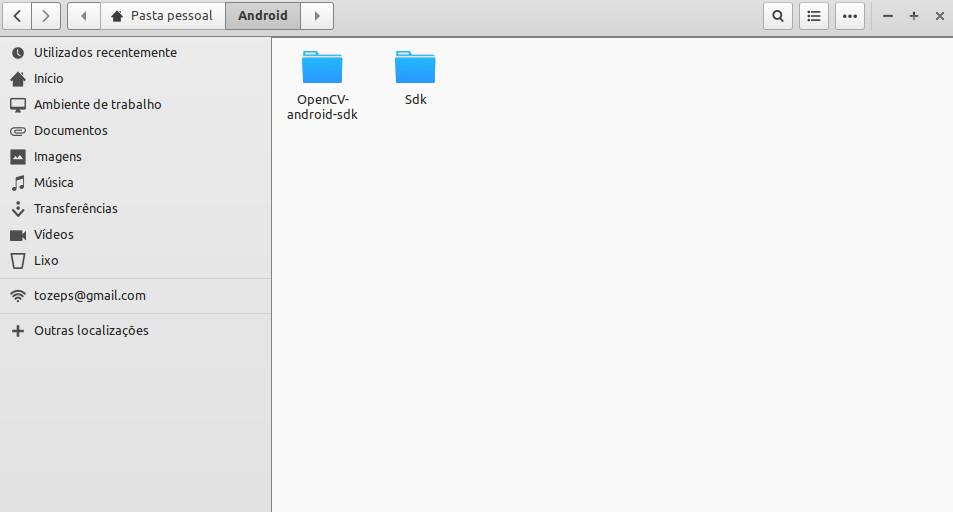
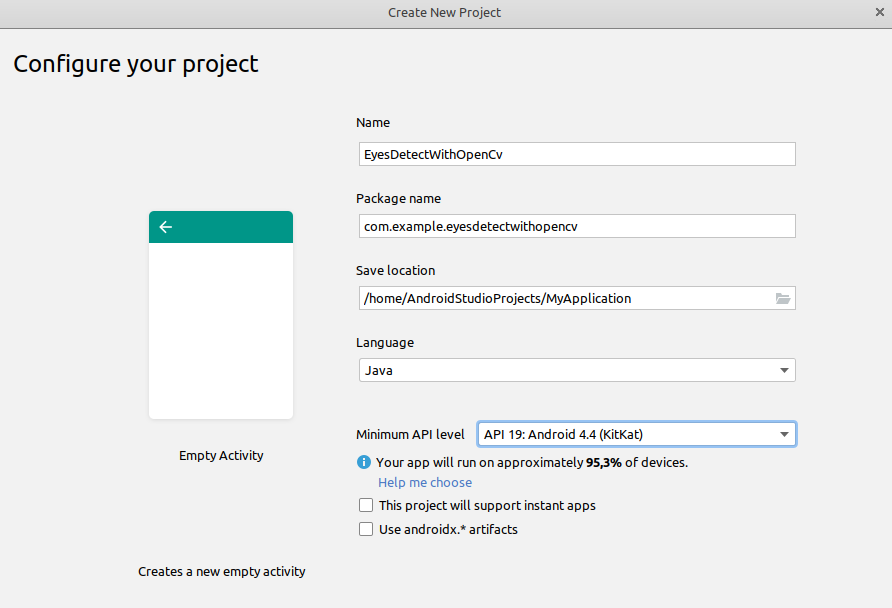
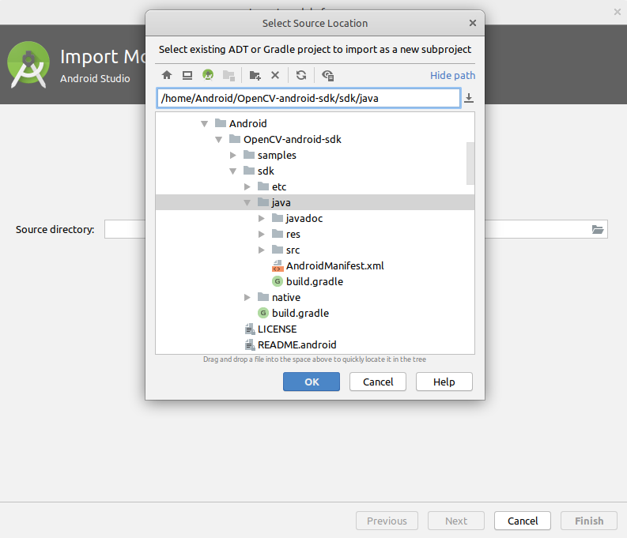
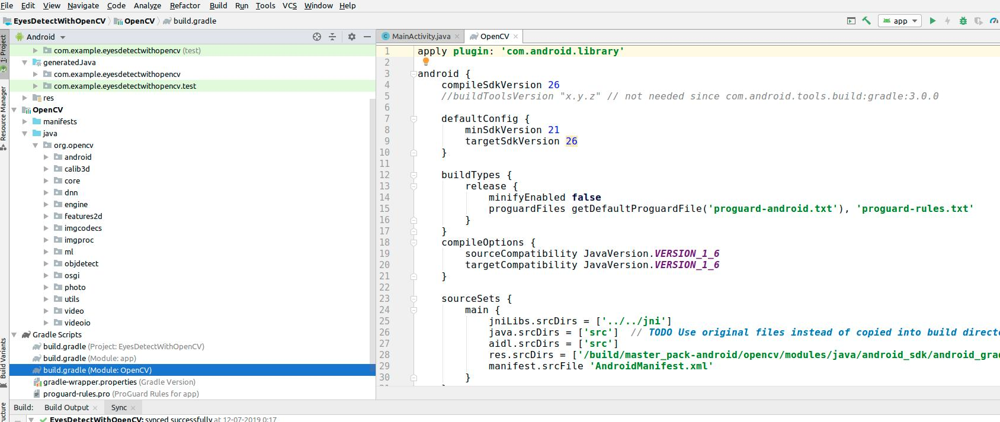
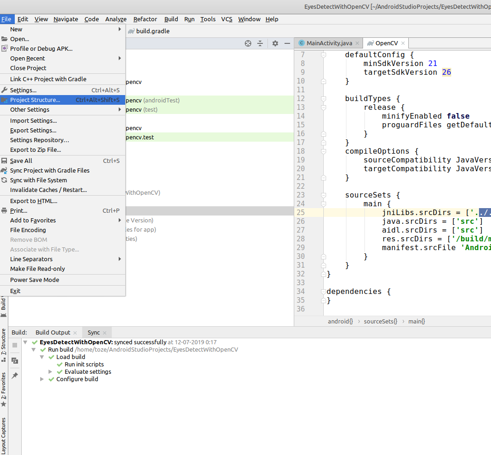
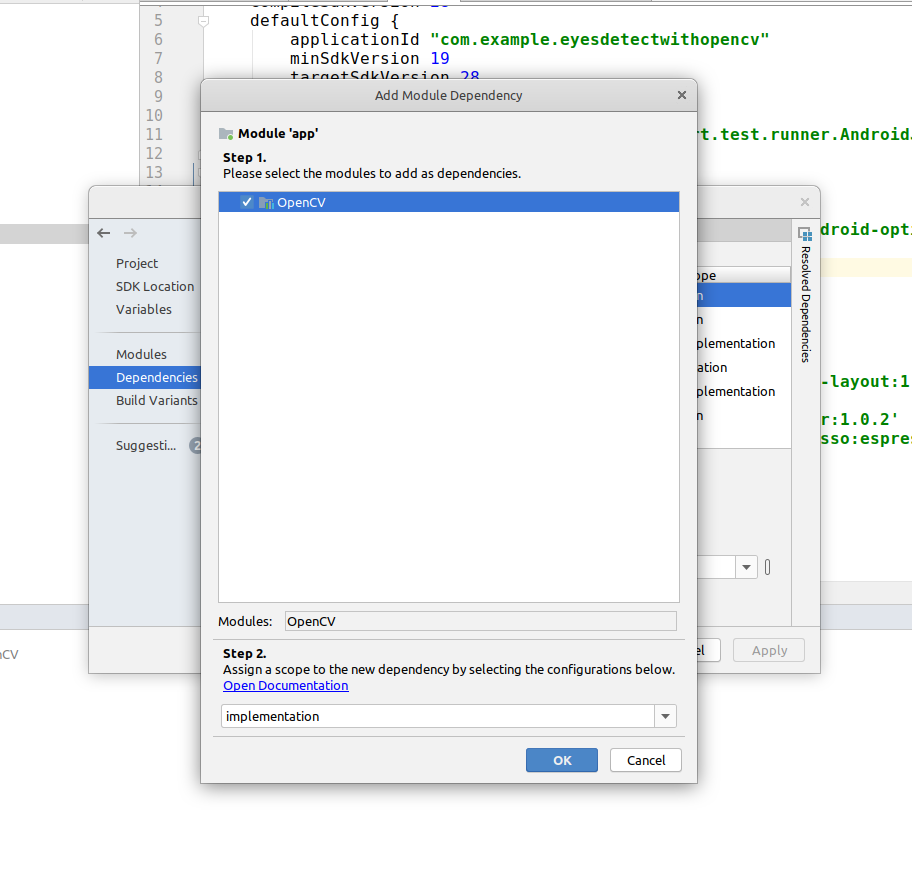
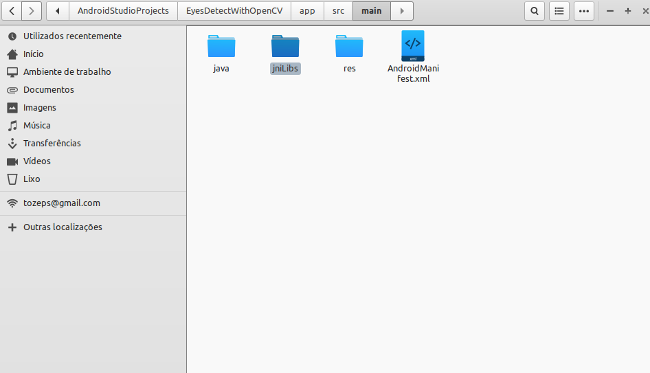
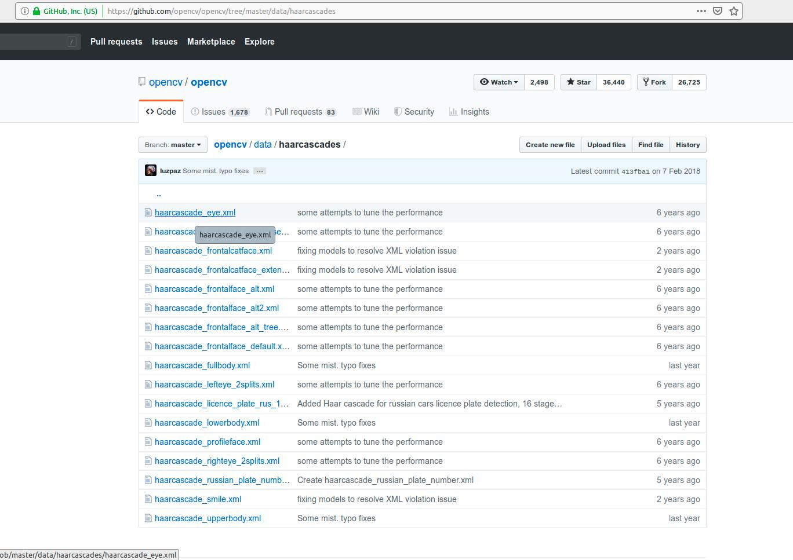
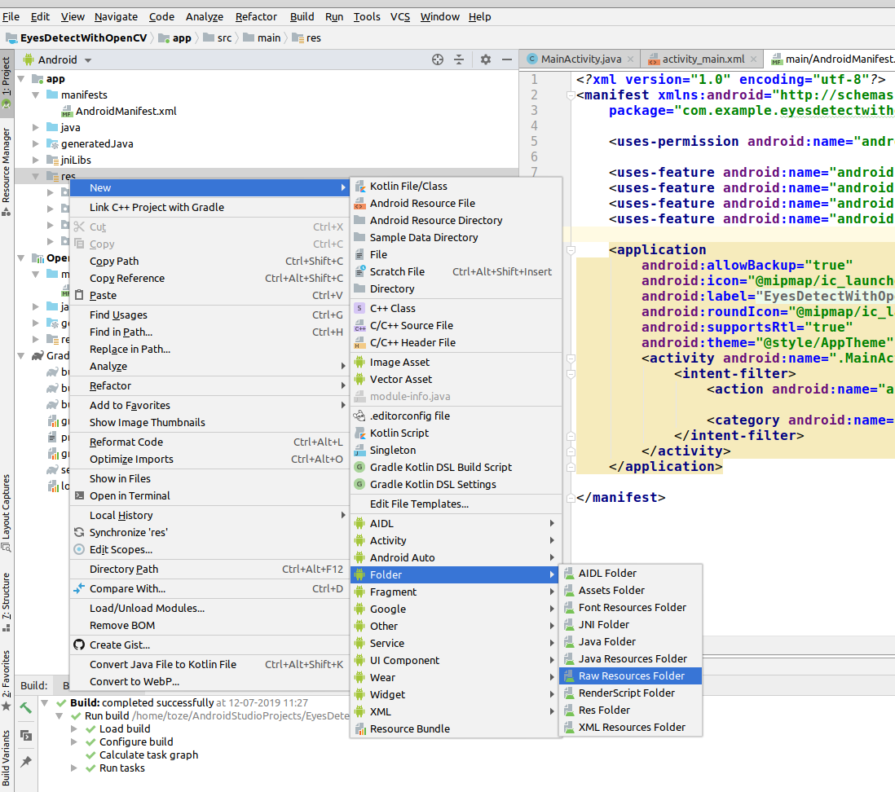
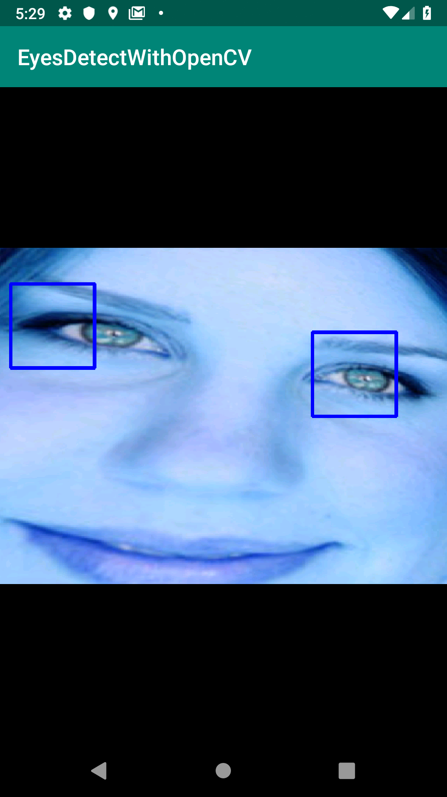

# OpenCV em Android


## Introdução
A aplicação no repositório já se encontra pronta a usar e possui alguns exemplos como 
tratamento de imagens, uso de camara para reconhecimento de formas como círculos
e uso de câmara para reconhecimento de faces e mãos com o recurso a cascade 
classifiers.

O que se pretende com este Workshop é reescrever uma nova aplicação para Android, 
seguir todo o processo de instalação e configuração do ambiente de trabalho, apresentar 
os métodos fundamentais de manipulação e uso da bilblioteca.
Por fim fazer uso de um classificador (eyes cascade) para identificar esse objeto numa 
imagem.

## Instalação
1.Ir até à página https://opencv.org/releases/ e realizar o download do sdk para Android.

2.Extrair o sdk do ficheiro zip para um local à vossa escolha. Eu usei a pasta Android. 



3.Iniciar um novo projeto no Android studio.



4.Importar um novo módulo: FIle -> New -> Import module. Escolher como source directory
a pasta java que se encontra na pasta do sdk OpenSV na localização semelhante a 
/Android/OpenCV-android-sdk/sdk/java. (Podes mudar o nome do módulo de :java para um  à tua escolha).



5.Se houver problemas com o Gradle Sync e aparecerem erros, temos que editar o ficheiro build.gradle do módulo que importámos. 
Alteramos os campos compileSdkVersion e targetSdkVersion para a versão sdk que temos instalado no nosso computador.



6.A seguir temos que adicionar o módulo como uma dependência da nossa aplicação, para isso vamos a FIle -> Project Structure.



7.Carregamos em Dependencies -> Modules (a nossa aplicação) -> Declared dependies (+) -> Modules e adicionamos o módulo OpenCV.



8.Se houver novamente problemas com o gradle, temos que alterar o campo minSdkVersion para a mesma versão que usamos na nossa aplicação.

9.O seguinte passo é copiar as bibliotecas nativas do sdk OpenCv para nossa pasta source, para isso vamos até à pasta OpencvSdk\sd\native\libs
e copiamos essa mesma pasta para a pasta app\src\main do nosso projeto Android (importante para não ser necessário instalar a apk
do OpenCV Manager, no entanto, é de notar que isto vai aumentar consideravelmente o tamanho da aplicação).

10.Renomeamos a pasta para jniLibs (o nome não importa).



11.Ao fazer o build da aplicação podemos ter erros de compilação, é necessário referir onde temos as nossas bibliotecas nativas. No build.gradle do
OpenCv alteramos o sourceSets para:
```
sourceSets {
        main {
            jniLibs.srcDirs = ['src']
            java.srcDirs = ['src']  
            aidl.srcDirs = ['src']
            res.srcDirs = ['res']
            manifest.srcFile 'AndroidManifest.xml'
        }
    }
```
12.Se tudo correr bem estamos prontos a correr a nossa aplicação com OpenCV.

## Preparar a Câmara
1.Precisamos pedir permissões para o uso da câmara, para isso vamos até ao ficheiro AndroidManifest.xml em manifests e adicionamos algo como:

    <uses-permission android:name="android.permission.CAMERA"/>

    <uses-feature android:name="android.hardware.camera" android:required="false"/>
    <uses-feature android:name="android.hardware.camera.autofocus" android:required="false"/>
    <uses-feature android:name="android.hardware.camera.front" android:required="false"/>
    <uses-feature android:name="android.hardware.camera.front.autofocus" android:required="false"/>

2.Como tive algumas dificuldades com permissões, coloquei também na classe MainActivity (ou na Actividade onde pretendemos usar OpenCV) a função:

```Java
 private void checkPermissions() {
        if (ContextCompat.checkSelfPermission(this,
                Manifest.permission.CAMERA)
                != PackageManager.PERMISSION_GRANTED) {
            ActivityCompat.requestPermissions(this,
                    new String[]{Manifest.permission.CAMERA},1);
        }
    }
```
Isto faz com que apareça a mensagem que nos permite requerer os privilégios necessários.
Não nos podemos esquecer de adicionar o método na altura da criação da atividade, ficando o código desta forma:

```Java
public class MainActivity extends AppCompatActivity {

    @Override
    protected void onCreate(Bundle savedInstanceState) {
        super.onCreate(savedInstanceState);
        setContentView(R.layout.activity_main);
        checkPermissions();
    }

    private void checkPermissions() {
        if (ContextCompat.checkSelfPermission(this,
                Manifest.permission.CAMERA)
                != PackageManager.PERMISSION_GRANTED) {
            ActivityCompat.requestPermissions(this,
                    new String[]{Manifest.permission.CAMERA},1);
        }
    }
}

```

3.Em seguida preparamos a nossa View. Para isso precisamos de ir até ao nosso activity_main.xml e colocar o seguinte código.
```
<?xml version="1.0" encoding="utf-8"?>
<android.support.constraint.ConstraintLayout
    xmlns:android="http://schemas.android.com/apk/res/android"
    xmlns:tools="http://schemas.android.com/tools"
    xmlns:app="http://schemas.android.com/apk/res-auto"
    android:layout_width="match_parent"
    android:layout_height="match_parent"
    tools:context=".MainActivity">

    <org.opencv.android.JavaCameraView
            android:id="@+id/eyes_detection_view"
            android:layout_width="match_parent"
            android:layout_height="match_parent" />

</android.support.constraint.ConstraintLayout>
```

JavaCameraView é um objeto OpenCV que nos permite manipular e apresentar os resultados do processamento da imagem.

4.Estamos prontos! Na nossa MainActivity.java vamos implementar a interface CvCameraViewListener2. Sendo necessário implementar as funções:
**onCameraViewStarted**
**onCameraViewStopped**
**onCameraFrame**

```Java

import android.Manifest;
import android.content.pm.PackageManager;
import android.support.v4.app.ActivityCompat;
import android.support.v4.content.ContextCompat;
import android.support.v7.app.AppCompatActivity;
import android.os.Bundle;
import org.opencv.android.CameraBridgeViewBase;
import org.opencv.core.Mat;

public class MainActivity extends AppCompatActivity implements CameraBridgeViewBase.CvCameraViewListener2 {

    @Override
    protected void onCreate(Bundle savedInstanceState) {
        super.onCreate(savedInstanceState);
        setContentView(R.layout.activity_main);
        checkPermissions();
    }

    private void checkPermissions() {
        if (ContextCompat.checkSelfPermission(this,
                Manifest.permission.CAMERA)
                != PackageManager.PERMISSION_GRANTED) {
            ActivityCompat.requestPermissions(this,
                    new String[]{Manifest.permission.CAMERA},1);
        }
    }

    @Override
    public void onCameraViewStarted(int width, int height) {

    }

    @Override
    public void onCameraViewStopped() {

    }

    @Override
    public Mat onCameraFrame(CameraBridgeViewBase.CvCameraViewFrame inputFrame) {
        return null;
    }
}
```
5.Precisamos inicializar o OpenCV Manager que tem a função de fazer a ligação entre o código JAVA e as bibliotecas nativas. Para isso, 
usamos um BaseLoaderCallback que tem a função de saber se este está instalado ou não no nosso dispositivo . Caso não o encontre, 
tenta fazer o donwload para o nosso aparelho.


É necessário também fazemos o Overrride da função **onResume**, que inicializa a biblioteca OpenCV. Caso não a encontre tenta fazer o download
pelos repositórios.
O código fica assim desta forma.
```Java

import android.Manifest;
import android.content.pm.PackageManager;
import android.support.v4.app.ActivityCompat;
import android.support.v4.content.ContextCompat;
import android.support.v7.app.AppCompatActivity;
import android.os.Bundle;
import org.opencv.android.*;
import org.opencv.core.Mat;

public class MainActivity extends AppCompatActivity implements CameraBridgeViewBase.CvCameraViewListener2 {


    @Override
    protected void onCreate(Bundle savedInstanceState) {
        super.onCreate(savedInstanceState);
        setContentView(R.layout.activity_main);
        checkPermissions();
    }

    private BaseLoaderCallback mLoaderCallback = new BaseLoaderCallback(this) {
        @Override
        public void onManagerConnected(int status) {
            switch (status) {
                case LoaderCallbackInterface.SUCCESS: {
                }
                break;
                default: {
                    super.onManagerConnected(status);
                }
                break;
            }
        }

    };

    private void checkPermissions() {
        if (ContextCompat.checkSelfPermission(this,
                Manifest.permission.CAMERA)
                != PackageManager.PERMISSION_GRANTED) {
            ActivityCompat.requestPermissions(this,
                    new String[]{Manifest.permission.CAMERA},1);
        }
    }

    @Override
    public void onCameraViewStarted(int width, int height) {

    }

    @Override
    public void onCameraViewStopped() {

    }

    @Override
    public Mat onCameraFrame(CameraBridgeViewBase.CvCameraViewFrame inputFrame) {
        return null;
    }

    @Override
    public void onResume() {
        super.onResume();
        if (!OpenCVLoader.initDebug()) {
            OpenCVLoader.initAsync(OpenCVLoader.OPENCV_VERSION_3_0_0, this, mLoaderCallback);
        } else {
            mLoaderCallback.onManagerConnected(LoaderCallbackInterface.SUCCESS);
        }
    }
}
```  
(Nota) OPENCV_VERSION segundo a versão que têm instalado no vosso computador.

6.A seguir indicamos um objeto ligado à View que indicámos em activity_main.xml. Um objeto do tipo **CameraBridgeViewBase**. 
Atribuimos a ligação em **onCreate** e inicializamos a view no **BaseLoaderCallback**, ficando o código desta forma.

```Java

import android.Manifest;
import android.content.pm.PackageManager;
import android.support.v4.app.ActivityCompat;
import android.support.v4.content.ContextCompat;
import android.support.v7.app.AppCompatActivity;
import android.os.Bundle;
import android.view.View;
import org.opencv.android.*;
import org.opencv.core.Mat;

public class MainActivity extends AppCompatActivity implements CameraBridgeViewBase.CvCameraViewListener2 {

    private CameraBridgeViewBase mOpenCvCameraView;

    @Override
    protected void onCreate(Bundle savedInstanceState) {
        super.onCreate(savedInstanceState);
        setContentView(R.layout.activity_main);
        checkPermissions();
        mOpenCvCameraView = (JavaCameraView) findViewById(R.id.eyes_detection_view);
        mOpenCvCameraView.setVisibility(View.VISIBLE);
        mOpenCvCameraView.setCvCameraViewListener(this);
    }

    private BaseLoaderCallback mLoaderCallback = new BaseLoaderCallback(this) {
        @Override
        public void onManagerConnected(int status) {
            switch (status) {
                case LoaderCallbackInterface.SUCCESS: {
                    mOpenCvCameraView.enableView();
                }
                break;
                default: {
                    super.onManagerConnected(status);
                }
                break;
            }
        }

    };

    private void checkPermissions() {
        if (ContextCompat.checkSelfPermission(this,
                Manifest.permission.CAMERA)
                != PackageManager.PERMISSION_GRANTED) {
            ActivityCompat.requestPermissions(this,
                    new String[]{Manifest.permission.CAMERA},1);
        }
    }

    @Override
    public void onCameraViewStarted(int width, int height) {

    }

    @Override
    public void onCameraViewStopped() {

    }

    @Override
    public Mat onCameraFrame(CameraBridgeViewBase.CvCameraViewFrame inputFrame) {
        return null;
    }

    @Override
    public void onResume() {
        super.onResume();
        if (!OpenCVLoader.initDebug()) {
            OpenCVLoader.initAsync(OpenCVLoader.OPENCV_VERSION_3_0_0, this, mLoaderCallback);
        } else {
            mLoaderCallback.onManagerConnected(LoaderCallbackInterface.SUCCESS);
        }
    }
}
```
7.Em seguida, vamos criar um objeto do tipo **Mat**, o objeto matriz em OpenCV que nos permite manipular cada frame.
Inicializamos a matriz em **onCameraViewStarted** com o tamanho recebido pela câmara. 
Ao mesmo tempo vamos fazer o Override das funções **onDestroy** e **onPause** para que os objetos libertem a câmara
 se a aplicação for interrompida. O código fica desta forma:
```Java
import android.Manifest;
import android.content.pm.PackageManager;
import android.support.v4.app.ActivityCompat;
import android.support.v4.content.ContextCompat;
import android.support.v7.app.AppCompatActivity;
import android.os.Bundle;
import android.view.View;
import org.opencv.android.*;
import org.opencv.core.CvType;
import org.opencv.core.Mat;

public class MainActivity extends AppCompatActivity implements CameraBridgeViewBase.CvCameraViewListener2 {

    private CameraBridgeViewBase mOpenCvCameraView;
    private Mat mRgba;

    @Override
    protected void onCreate(Bundle savedInstanceState) {
        super.onCreate(savedInstanceState);
        setContentView(R.layout.activity_main);
        checkPermissions();
        mOpenCvCameraView = (JavaCameraView) findViewById(R.id.eyes_detection_view);
        mOpenCvCameraView.setVisibility(View.VISIBLE);
        mOpenCvCameraView.setCvCameraViewListener(this);
    }

    private BaseLoaderCallback mLoaderCallback = new BaseLoaderCallback(this) {
        @Override
        public void onManagerConnected(int status) {
            switch (status) {
                case LoaderCallbackInterface.SUCCESS: {
                    mOpenCvCameraView.enableView();
                }
                break;
                default: {
                    super.onManagerConnected(status);
                }
                break;
            }
        }

    };

    private void checkPermissions() {
        if (ContextCompat.checkSelfPermission(this,
                Manifest.permission.CAMERA)
                != PackageManager.PERMISSION_GRANTED) {
            ActivityCompat.requestPermissions(this,
                    new String[]{Manifest.permission.CAMERA},1);
        }
    }

    @Override
    public void onCameraViewStarted(int width, int height) {
        mRgba = new Mat(height, width, CvType.CV_8UC4);
    }

    @Override
    public void onCameraViewStopped() {

    }


    @Override
    public void onDestroy() {
        super.onDestroy();
        mRgba.release();
        if (mOpenCvCameraView != null) {
            mOpenCvCameraView.disableView();
        }
    }

    @Override
    public void onPause() {
        super.onPause();
        if (mOpenCvCameraView != null) {
            mOpenCvCameraView.disableView();
        }
    }

    @Override
    public Mat onCameraFrame(CameraBridgeViewBase.CvCameraViewFrame inputFrame) {
        return null;
    }

    @Override
    public void onResume() {
        super.onResume();
        if (!OpenCVLoader.initDebug()) {
            OpenCVLoader.initAsync(OpenCVLoader.OPENCV_VERSION_3_0_0, this, mLoaderCallback);
        } else {
            mLoaderCallback.onManagerConnected(LoaderCallbackInterface.SUCCESS);
        }
    }
}
```
8.Fazendo o build e executar a aplicação, estamos prontos a usar a câmara através de objetos OpenCV.

## Cascade classifier

1.Fazer o download do ficheiro xml em https://github.com/opencv/opencv/blob/master/data/haarcascades/haarcascade_eye.xml.



2.Criar uma pasta raw nos nossos recursos: botão direito do rato sobre a pasta res -> New -> Folder -> Raw Resources Folder, e passar o ficheiro haarcascade_eye.xml para a pasta recém criada.



3.Em seguida criamos uma variável global do tipo CascadeClassifier e um método privado que nos vai permitir inicializar a variável e importar o ficheiro xml para uso na nossa aplicação. 
O código é o seguinte:
```Java
private void initializeEyeCascade(){
        try {
            InputStream is = getResources().openRawResource(R.raw.haarcascade_eye);
            File cascadeDir = getDir("cascade", Context.MODE_PRIVATE);
            File mCascadeFile = new File(cascadeDir, "haarcascade_eye.xml");
            FileOutputStream os = new FileOutputStream(mCascadeFile);
            byte[] buffer = new byte[8192];
            int bytesRead;
            while ((bytesRead = is.read(buffer)) != -1) {
                os.write(buffer, 0, bytesRead);
            }
            is.close();
            os.close();
            cascadeClassifier = new CascadeClassifier(mCascadeFile.getAbsolutePath());
        } catch (Exception e) {
            Log.e(MainActivity.class.toString(), "Error loading cascade", e);
        }
    }
```
E usamos o método no nosso CallBack, logo que o Manager OpenCv seja inicializado com sucesso.

```Java
private BaseLoaderCallback mLoaderCallback = new BaseLoaderCallback(this) {
        @Override
        public void onManagerConnected(int status) {
            switch (status) {
                case LoaderCallbackInterface.SUCCESS: {
                    initializeEyeCascade();
                    mOpenCvCameraView.enableView();
                }
                break;
                default: {
                    super.onManagerConnected(status);
                }
                break;
            }
        }

    };
```
4.Criamos uma varável global do tipo inteiro (absoluteSize) para definir o tamanho do objeto que queremos identificar nos frames. Isto permite controlar a identificação do objeto 
apenas a uma determinada distância. Inicializamos a variável apenas no método **onCameraViewStarted**.

```Java
  @Override
    public void onCameraViewStarted(int width, int height) {
        absoluteSize = (int) (height * 0.3);
        mRgba = new Mat(height, width, CvType.CV_8UC4);
    }
``` 

5.Criamos dois métodos privados (separando objetivos) para identificar os objetos(olhos) na imagem e desenhar retângulos à volta da área identificada.

```Java
 private Rect[] calculateRectangles(){
        MatOfRect hands = new MatOfRect();
        if (cascadeClassifier != null) {
            cascadeClassifier.detectMultiScale(mRgba, hands, 2, 1, 1,
                    new Size(absoluteSize, absoluteSize), new Size());
        }
        return hands.toArray();
    }

    private void drawRectangles(Rect[] facesArray) {
        if (facesArray != null) {
            for (Rect rect : facesArray) {
                Rect2d rd = new Rect2d();
                rd.height = rect.height;
                rd.width = rect.width;
                rd.x = rect.x;
                rd.y = rect.y;
                Imgproc.rectangle(mRgba, rd.tl(), rd.br(), new Scalar(0, 0, 255, 255), 4, 8);
            }
        }
    }
```
O primeiro método usa o objeto CascadeClassifier para detetar pontos comuns ao classificador no frame inscrito na matris (mRgba). MactOfRect é outro objeto da biblioteca OpenCV que permite obter as coordenadas 
dos rectangulos escritos sobre a imagem. Em seguida usamos o array de Rectangulos para os desenhar na imagem: **ImgProc.rectangle**, passamos como argumentos o tamanho do retângulo, cor, a expessura da 
linha e o tipo de linha.

6.Usamos os dois métodos anteriores em **onCameraFrame**, como a seguir:

```Java
@Override
    public Mat onCameraFrame(CameraBridgeViewBase.CvCameraViewFrame inputFrame) {
        mRgba = inputFrame.rgba();
        ChangeFrame.changeRotation(display, mRgba, mRgbaF, mRgbaT);
        drawRectandles(calculateRectangles());
        return mRgba;
    }
```

## Rotação da imagem
1.Depois de detestarem o vosso código, pode acontecer que a imagem se encontra numa posição lateral, é necessário, então, fazer a rotação do frame. 
Para isso criamos 3 variéveis auxiliares e inicializamo-las em **onCameraViewStarted**. Como a seguir:
```Java 
	@Override
    public void onCameraViewStarted(int width, int height) {
        absoluteSize = (int) (height * 0.2);
        mRgba = new Mat(height, width, CvType.CV_8UC4);
        mRgbaF = new Mat(height, width, CvType.CV_8UC4);
        mRgbaT = new Mat(width, width, CvType.CV_8UC4);
        display = ((WindowManager)
                getSystemService(Context.WINDOW_SERVICE)).getDefaultDisplay();
    }

```
Em seguida, escrevemos as seguintes funções para rodar o frame.

```Java
    private int getOrientation(Display display ) {
        int rotation = display.getRotation();
        switch (rotation) {
            case 0:
            case 2:
                return 1;
            default:
                return 0;
        }
    }

    private void changeRotation(Display display, Mat mRgba, Mat mRgbaF, Mat mRgbaT) {
        Core.transpose(mRgba, mRgbaT);
        Imgproc.resize(mRgbaT, mRgbaF, mRgbaF.size(), 0, 0, 0);
        if (getOrientation(display) != 0) {
            Core.flip(mRgbaF, mRgba, 1));
        }
    }
```
Obtemos a rotação definida no nosso dispositivo a atribuimos uma das posições 0 ou 1(roda 90 graus) ao frame, através de **Core.flip**. 
E colocamos a função logo a seguir à captura do frame em **onCameraFrame**.

```Java
@Override
    public Mat onCameraFrame(CameraBridgeViewBase.CvCameraViewFrame inputFrame) {
        mRgba = inputFrame.rgba();
        changeRotation(display, mRgba, mRgbaF, mRgbaT);
        absoluteSize = (int) (mRgba.rows() * 0.2);
        drawRectangles(calculateRectangles());
        return mRgba;
    }
```
2.Se tudo correr bem, obtemos um resultado semelhante ao da imagem abaixo.



3.Para melhorar a deteção podemos ainda usar alguns filtros na imagem como blur.
```Java
private Rect[] calculateRectangles(){
        MatOfRect eyes = new MatOfRect();
        Mat grayImage = new Mat();
        Imgproc.cvtColor(mRgba, grayImage, Imgproc.COLOR_RGB2GRAY);
        Imgproc.medianBlur(grayImage, grayImage, 5);
        Size size = new Size(5,5);
        Imgproc.GaussianBlur(grayImage, grayImage, size, 0,0);
        if (cascadeClassifier != null) {
            cascadeClassifier.detectMultiScale(grayImage, eyes, 6, 1, 1,
                    new Size(absoluteSize, absoluteSize), new Size());
        }
        retur
```
O código final ficou desta forma.
```Java

import android.Manifest;
import android.content.Context;
import android.content.pm.PackageManager;
import android.support.v4.app.ActivityCompat;
import android.support.v4.content.ContextCompat;
import android.support.v7.app.AppCompatActivity;
import android.os.Bundle;
import android.util.Log;
import android.view.Display;
import android.view.View;
import android.view.WindowManager;

import org.opencv.android.*;
import org.opencv.core.Core;
import org.opencv.core.CvType;
import org.opencv.core.Mat;
import org.opencv.core.MatOfRect;
import org.opencv.core.Rect;
import org.opencv.core.Rect2d;
import org.opencv.core.Scalar;
import org.opencv.core.Size;
import org.opencv.imgproc.Imgproc;
import org.opencv.objdetect.CascadeClassifier;

import java.io.File;
import java.io.FileOutputStream;
import java.io.InputStream;

public class MainActivity extends AppCompatActivity implements CameraBridgeViewBase.CvCameraViewListener2 {

    private CameraBridgeViewBase mOpenCvCameraView;
    private CascadeClassifier cascadeClassifier;
    private int absoluteSize;
    private Mat mRgba;
    private Display display;
    Mat mRgbaF, mRgbaT;


    @Override
    protected void onCreate(Bundle savedInstanceState) {
        super.onCreate(savedInstanceState);
        setContentView(R.layout.activity_main);
        checkPermissions();
        mOpenCvCameraView = (JavaCameraView) findViewById(R.id.eyes_detection_view);
        mOpenCvCameraView.setVisibility(View.VISIBLE);
        mOpenCvCameraView.setCvCameraViewListener(this);
    }

    private BaseLoaderCallback mLoaderCallback = new BaseLoaderCallback(this) {
        @Override
        public void onManagerConnected(int status) {
            switch (status) {
                case LoaderCallbackInterface.SUCCESS: {
                    initializeEyeCascade();
                    mOpenCvCameraView.enableView();
                }
                break;
                default: {
                    super.onManagerConnected(status);
                }
                break;
            }
        }

    };

    private void checkPermissions() {
        if (ContextCompat.checkSelfPermission(this,
                Manifest.permission.CAMERA)
                != PackageManager.PERMISSION_GRANTED) {
            ActivityCompat.requestPermissions(this,
                    new String[]{Manifest.permission.CAMERA},1);
        }
    }

    @Override
    public void onCameraViewStarted(int width, int height) {
        absoluteSize = (int) (height * 0.3);
        mRgba = new Mat(height, width, CvType.CV_8UC4);
        mRgbaF = new Mat(height, width, CvType.CV_8UC4);
        mRgbaT = new Mat(width, width, CvType.CV_8UC4);
        display = ((WindowManager)
                getSystemService(Context.WINDOW_SERVICE)).getDefaultDisplay();
    }

    @Override
    public void onCameraViewStopped() {

    }


    @Override
    public void onDestroy() {
        super.onDestroy();
        mRgba.release();
        if (mOpenCvCameraView != null) {
            mOpenCvCameraView.disableView();
        }
    }

    @Override
    public void onPause() {
        super.onPause();
        if (mOpenCvCameraView != null) {
            mOpenCvCameraView.disableView();
        }
    }

    @Override
    public Mat onCameraFrame(CameraBridgeViewBase.CvCameraViewFrame inputFrame) {
        mRgba = inputFrame.rgba();
        changeRotation(display, mRgba, mRgbaF, mRgbaT);
        drawRectangles(calculateRectangles());
        return mRgba;
    }

    @Override
    public void onResume() {
        super.onResume();
        if (!OpenCVLoader.initDebug()) {
            OpenCVLoader.initAsync(OpenCVLoader.OPENCV_VERSION_3_0_0, this, mLoaderCallback);
        } else {
            mLoaderCallback.onManagerConnected(LoaderCallbackInterface.SUCCESS);
        }
    }

    private Rect[] calculateRectangles(){
        MatOfRect eyes = new MatOfRect();
        Mat grayImage = new Mat();
        Imgproc.cvtColor(mRgba, grayImage, Imgproc.COLOR_RGB2GRAY);
        Imgproc.medianBlur(grayImage, grayImage, 5);
        Size size = new Size(5,5);
        Imgproc.GaussianBlur(grayImage, grayImage, size, 0,0);
        if (cascadeClassifier != null) {
            cascadeClassifier.detectMultiScale(grayImage, eyes, 6, 1, 1,
                    new Size(absoluteSize, absoluteSize), new Size());
        }
        return eyes.toArray();
    }

    private void drawRectangles(Rect[] facesArray) {
        if (facesArray != null) {
            for (Rect rect : facesArray) {
                Rect2d rd = new Rect2d();
                rd.height = rect.height;
                rd.width = rect.width;
                rd.x = rect.x;
                rd.y = rect.y;
                Imgproc.rectangle(mRgba, rd.tl(), rd.br(), new Scalar(0, 0, 255, 255), 4, 8);
            }
        }
    }

    private void initializeEyeCascade(){
        try {
            InputStream is = getResources().openRawResource(R.raw.haarcascade_eye);
            File cascadeDir = getDir("cascade", Context.MODE_PRIVATE);
            File mCascadeFile = new File(cascadeDir, "haarcascade_eye.xml");
            FileOutputStream os = new FileOutputStream(mCascadeFile);
            byte[] buffer = new byte[8192];
            int bytesRead;
            while ((bytesRead = is.read(buffer)) != -1) {
                os.write(buffer, 0, bytesRead);
            }
            is.close();
            os.close();
            cascadeClassifier = new CascadeClassifier(mCascadeFile.getAbsolutePath());
        } catch (Exception e) {
            Log.e(MainActivity.class.toString(), "Error loading cascade", e);
        }
    }

    private int getOrientation(Display display ) {
        int rotation = display.getRotation();
        switch (rotation) {
            case 0:
            case 2:
                return 1;
            default:
                return 0;
        }
    }

    private void changeRotation(Display display, Mat mRgba, Mat mRgbaF, Mat mRgbaT) {
        Core.transpose(mRgba, mRgbaT);
        Imgproc.resize(mRgbaT, mRgbaF, mRgbaF.size(), 0, 0, 0);
        if (getOrientation(display) != 0) {
            Core.flip(mRgbaF, mRgba, 1);
        }
    }
}
```

## Conclusão

No repositório poderão encontrar outros exemplos, assim como a utilização de código nativo para escreverem as suas próprias funções
em C++ utilizando para isso o ndk para Android.